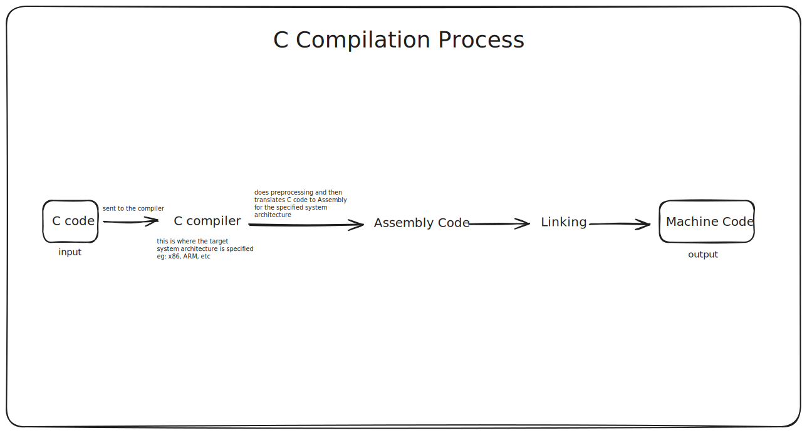

# Brief History of C++

## C

Before C++, there was **C**, a general-purpose, high-level programming language created by **Dennis Ritchie** in _1972_ at Bell
Telephone Laboratories (often called, Bell Labs).

Some of Dennis' goals was to created a language that was portable, easy to compile, provided efficient access to memory, produced efficient code and was self-reliant. In the context of self-reliance, given that most of the languages at the time relied on other languages or external tools to build their key features, for example:

- **COBOL**, **FORTRAN** and **ALGOL** depended on Assembly as compilers for both languages where written in Assembly Language.
- **Pascal** having it's compiler initially written in Assembly, while utilizing other languages and tools
- Other languages writing their features in Machine Language _(hmmm, must've been rough)_.

The issue with basing technology on other technologies is introduction of dependency, i.e: dependency on other technologies. When features were written in Assembly, they had to rewritten to support different hardware, given that Assembly is hardware-specific (assembly code written for one hardware cannot work for other hardware), and features written in Machine Language were error-prone given the herculean task of writing error-free 1's and 0's.

To achieve C's self-reliance, Dennis employed a technique formally called **"Bootstrapping"**. In the context of programming languages,
bootstrapping refers to the process of writing a program in one language, then rewriting it in the same language (or another programming language) to improve it or make it self-sustaining.

So with this technique, the original compiler for C was written in Assembly. Once functional, the compiler was then **rewritten in C**, enabling it to **generate machine code** for the next version, making C **the first high-level programming language to achieve true self-reliance**. This meant that libraries and tools for the language could be written in C itself, without depending on other tools or languages. Additionally, C gave programmers the flexibility to write code that could be easily compiled to support various hardware platforms—pretty cool!

**Note: this may be moved later**

## C++

C++ was developed by Bjarne Stroustrup in 1979 at Bell Labs as an extension to C. At this time, C++ added many features to the C language and is sometimes best thought of as a superset of C, however this is not technically accurate as the certain versions of C such as C99 (a standardized version of C) contains features that still do not exist in C++. One notable innovation that C++ has over C would be that it supports object-oriented programming, which is extensively in modern programming.

**Tip 🪙:** upgrades to the C++ language are expected every **3 years**.

**Funny story 😂:** C++'s 2020 version; C++20's formal name is ISO/IEC 14882:2020, but nobody is going to call it that, so they refer to it informally, as C++20 when referring to the version (with 20 being the version published in 2020).

## C & C++'s Philosophy

> _Trust the programmer._

according to the author of this article i'm reading on learncpp.com, the languages give so much freedom to the programmer and this can be amazing and also pretty risky, because with these languages there are almost limitless possibilities to what can be built with it but at the same time, there are limitless possibilities as to what can be done wrong with it. So it is just as important to learn what not to do as it is to learn what to do.
