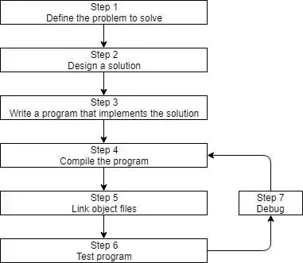
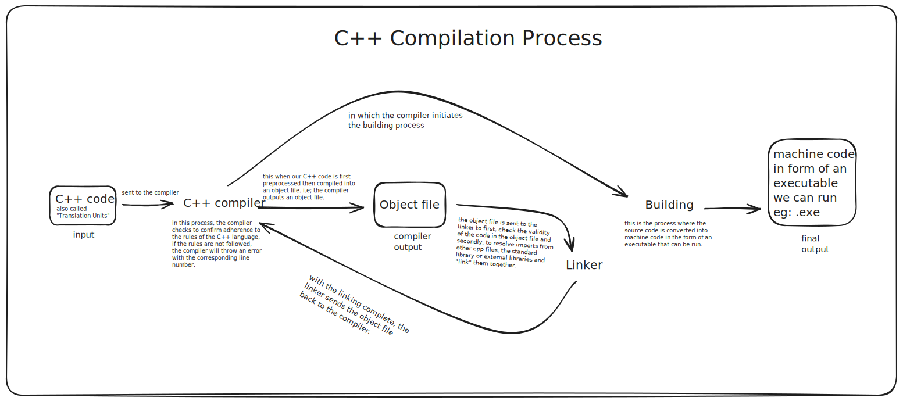

# C++ Development

## How C++ programs get developed

## Step 1 - 3

[Reference link to article for steps 1 - 3 explanation](https://www.learncpp.com/cpp-tutorial/introduction-to-cpp-development/)

**best practice 👍:** the defacto standard for naming the first/primary source file when writing C++ is `main.cpp`.

## Step 4 - 7

[Reference link to article for steps 4 - 7 explanation](https://www.learncpp.com/cpp-tutorial/introduction-to-the-compiler-linker-and-libraries/)

